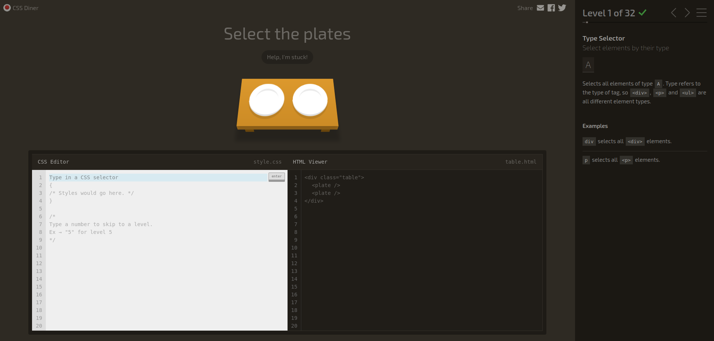
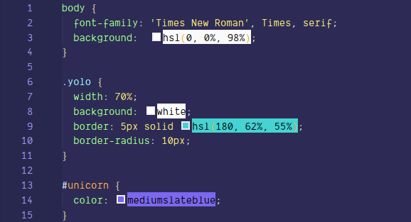
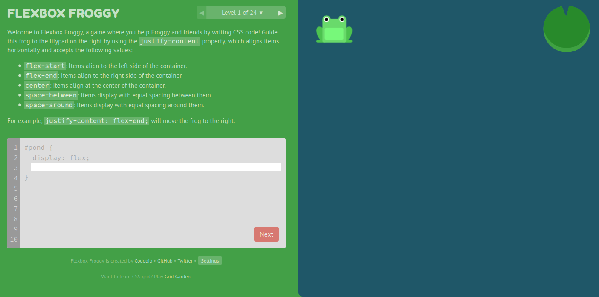
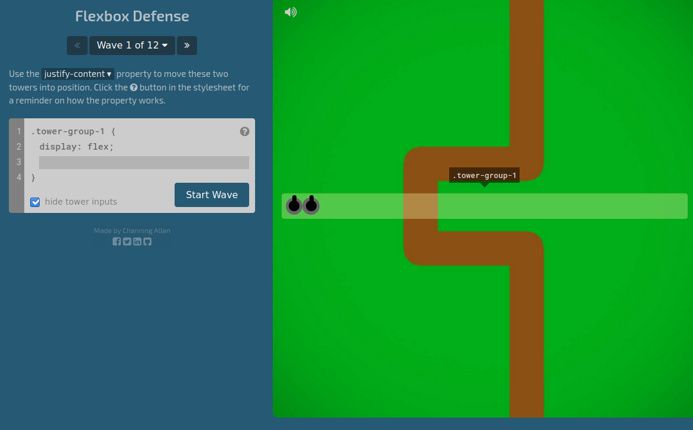

# A little fun 🎮

I started to learn CSS thanks to **Grafikart**'s [course](https://www.youtube.com/playlist?list=PLjwdMgw5TTLVjTZQocrMwKicV5wsZlRpj) on YouTube, and Flexbox' tools with **Wes Bos**' [playlist](https://www.youtube.com/playlist?list=PLu8EoSxDXHP7xj_y6NIAhy0wuCd4uVdid). Regularly, I took little breaks at some point of the playlists and trained with **3 games** I discovered this last week ! And believe me, you'll need some breaks throughout your *learning process*. Those games are a great mix between **resting** and **training** your *skills*. In some way, they materialize tools and functions that can sometimes leave us a very abstract feeling right after a course. Well, I let you discover those *cute* and *tricky* **games** !

## CSS Diner 🍱

This [game](https://flukeout.github.io/) was the first I tried (and succeed !). It's about **CSS selectors** : their nature and how their **rules** interact with each other.

A **CSS selector** is the part of a CSS rule that describes what *elements* in a document the rule will match. The **matching elements** will have the rule's specified style applied to them. Your selector can be an single **element**, such as `body`. But it can also be a **class**, such as `yolo` : then all your elements with the class `yolo` will match the rule's specified style. You can also use an **ID**, like `unicorn`, then the style of all your `unicorn` elements will be set. But let's go back to our game. In CSS Diner, you'll explore selectors' possibilities for **32 levels** by releasing *cute* and *bouncing* items such as **plates**, **bentos** and **fruits**. Go try it out ! 😄

## Froggy Flexbox 🐸

Aaah, **Flexbox**. Such an awesome **CSS module** but also so confusing ! As the baby developer I am, I confess : I find this part of CSS as _fantastic_ as _frightening_, haha. The Flex layout is an entire CSS module which contains its own bunch of _properties_. Metaphorically, that means Flexbox is like a little **toolbox** contained in a larger toolbox (CSS). It consists in a box model optimized for user interface design. This model allows you to organize the different parts and items of your website. More concretely, in this model, the *children* of a **flex container** can be laid out in any direction, and can “flex” their sizes, either growing to fill unused space or shrinking to avoid overflowing the *parent*. The elements' alignment is organized depending on the **main axis** (horizontal) and the **cross axis** (vertical). You can also manage the boxes' nesting to build layouts in two dimensions. In practice, it's a **fantastic tool** to use when you build the _responsive_ part of a website. What is responsive ? Hehe, that will require an entire article if you want a clear and smooth explanation. Let's get back to business.

Once you've learned Flexbox' basics, you can try this [game](https://flexboxfroggy.com/) out. It's even cuter than CSS Diner : you'll *help* **frogs** to return to their **lilypad** and to the correct side of the pond, using _Flexbox properties_ !

## Flexbox Defense 🏰

This last [game](http://www.flexboxdefense.com/) works the same way as the two others, but this time your goal is to **protect** your base by organizing your **defense**. You'll position your **towers** using _CSS Flexbox_ to stop the incoming **enemies**. Like CSS Diner and Froggy Flexbox, the levels are getting harder as you progress in the game. Enjoy !

I let you discover these 3 games, feel free to share your **enthusiasm** ! 😉

>References :
> - [MDN CSS Selectors](https://developer.mozilla.org/en-US/docs/Glossary/CSS_Selector)
> - [W3C Flexbox](https://www.w3.org/TR/css-flexbox-1/#overview)
> - [CSS tricks - Guide to Flexbox](https://css-tricks.com/snippets/css/a-guide-to-flexbox/)
