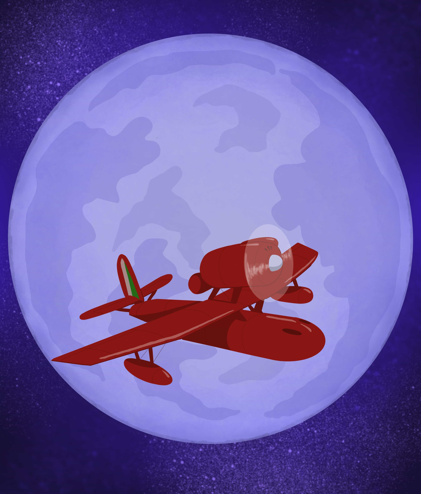
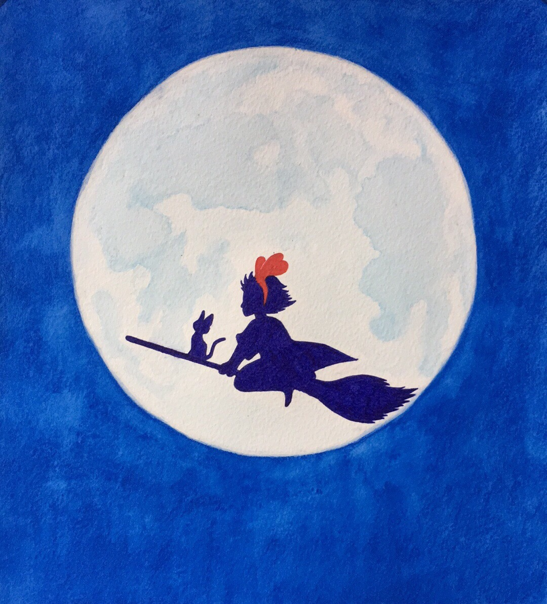
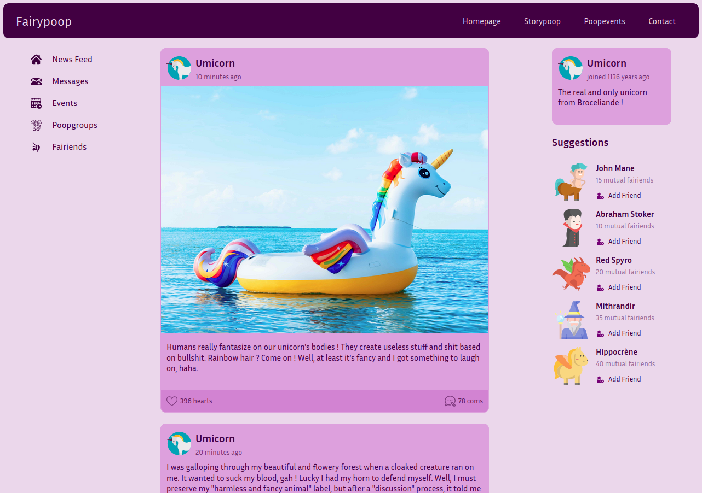

# How I ended up learning web development ? 🤔🖥

## About me 🌿

I'm a 23 years old **french woman** and I'm from **Bordeaux** 🍷, France. I'm a creative being, and since as long as I can remember, I love to _draw_, _write_ and _sing_. I'm not a pro in those fields but I love to share my **creations** 🦄 or my voice with my loved ones. Today I'd like to share one of my drawings on this blog. I can't share my voice yet but don't worry, I keep singing and I plan to realize a nice project !

As you can see I love **Ghibli's universe**. Here's a _Porco Rosso_ ✈️ inspiration drawing ! I made it (from scratch obviously) thanks to **Procreate** on my iPad pro. It's a really instinctive app to draw using _calque_. It offers many different _brushes_ 🖌 but you can also create your own or add downloaded brushes to your inventory. The feeling is almost paperlike, with added possibilities !

I'm also a **horse enthusiast** since 2004. I'm far from being a senior dev but I can say I'm a _senior rider_, haha. I can talk about horses and _horsemanship_ for hours. But I'll only share two thoughts about this subject :
- Keep a **critical mind** when people tell you about horses and how they comprehend them.
- Always remember that this sport involves an **intelligent** and **sensitive** being who communicates through a **different language** that you must try to understand. "Art is the result of skill exalted by love" - *(L'art, c'est la sublimation de la technique par l'amour)* [*Nuno Oliveira*](https://fr.wikipedia.org/wiki/Nuno_Oliveira)

## My student journey 📚

I've always been searching inspiration for studies without finding it. I tried different fields, like **biology**, and more recently, **speech therapy** that I've been learning for _3 years_. I struggled a lot thinking about _quitting_, but _deceiving_ my family and friends at the same time. And I struggled with this **big question** : "***What do I want to do with my life ?***"

I'm not sure of the answer, but I know that I want to do something I like, something that allows me to **express myself** and that makes me **learning new stuff** everyday. I also love to create content (even shitty and dumb, as long as it makes people laugh and smile) and to know how things work in the background. So I searched in artistic and creative fields, and after [kissu](https://twitter.com/kissu_io) 🍉 told me more about **web development** and brought me to a **meetup**, I started my learning.

And that, dear reader, is how I met web development. haha

## What's up after 1 month ? 💻

I started my learning the **16th of March** thanks to kissu who's _mentoring_ me. Here's a list of what I've _learned_ & _done_ during this month :
- **HTML** and attributes
- Many shortkeys
- Typing on a qwerty ANSI HHKB keyboard
- **Git** commands on Linux Terminal (especially `git init`, `add`, `commit` and `push`)
- GitHub (Gitflow : using branches to organize my code)
- VScode
- **CSS**, Flexbox and CSSgrid
- Watched 2 talks (Sara Vieira and Feross) and read
- Starting to blog and updating my Twitter
- Sharing my improvements

And I began learning **JS** since yesterday night (04.14.20) ! I follow [Wes Bos](https://wesbos.com/)' course.

I have to say that I really **love** what I'm currently learning. The possibilities are _infinite_ and I'm sure I'll find my place in the web development community, especially in a Frontend role. We'll see where I go ! 😄
