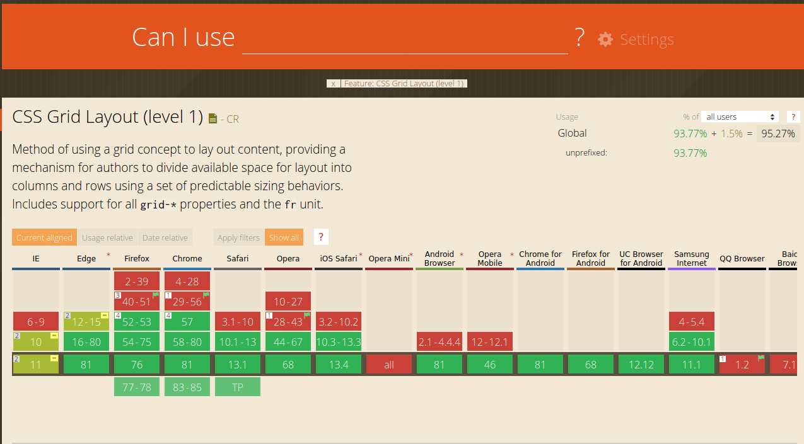

# [IN PROGRESS] What is a "responsive design" ?

When you build a website, you want it to be reachable and functional on a desktop's screen, obviously, but also on a laptop, a tablet or a mobile phone. Congratulations, you've learnt 1/3 of what means "responsive" !

Nowadays different types of devices appear every day with tons of different screens, sizes and functionalities. When you build an app or a website, you can't make it work with pixel perfect (even if it can be satisfying), you must adapt and provide it for a maximum of machines. But guess what ? Responsiveness doesn't only depend on the device's type and size, but is also changing according to your browser. Not all browsers can support all the existent properties. For example, if you're planning on using CSSgrid to organize your website's elements, make sure your client(s) is not using an old browser or an uncommon one. To do so, you can visite [Can I Use](https://caniuse.com/), an ingenious website where you can check browser support tables for a all bunch of properties and formats.

- And accessible for a person with any kind of disability

## But how can I build a responsive website or web app ?

Guess what ? CSS isn't just for styling ! By using media queries and its properties like `screen` `max-width`, `min-width`
Media queries

- CSS isn't just for styling !
- More complex
- Flexbox and CSSgrid

