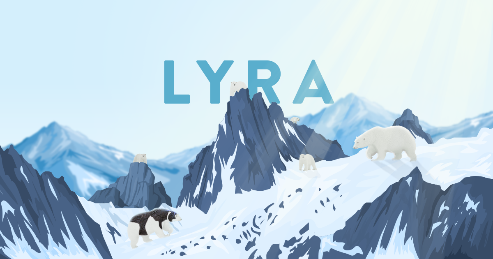

# A fresh start 🌱

Today was the beginning of a **6 months** long journey with **O'clock**, a remote **web development** school. I was looking forward to this *big liftoff* since a few months now !! As you may know, *I began learning web development since the 16th of March*, after quitting my Speech Therapy school. Since then, my boyfriend (who helped me a lot) and I were searching a bootcamp I could do to **gain knowledge and experience**. To our point of view, O'clock was way beyond the other bootcamps, and I chose their **Fullstack JS course**. 

## O'clock bootcamp ⏰

I'm just going to talk about the specific bootcamp that I chose, but if you want further informations about O'clock, [there you go](https://oclock.io/) ! So, our student group is called **Lyra**, just as the constellation 💫 but also as *Lyra Belacqua* from *His Dark Materials* by Philip Pullman. This name is perfect, right ? But the most enthusiasting is the **program** : 

### The base

- Season 1 : 
  - **HTML**, **CSS**, Linux and **CLI**
  - Collaborating work with **Git**
- Season 2 : 
  - **Javascript** : algorithms, functions, variables
- Season 3 : 
  - **Node.js** : first dynamic website with Express
- Season 4 : 
  - **Object Oriented Prog** and **SQL** with a new project
- Season 5 : 
  - Database : **NoSQL** and **MongoDB**
  - User Stories, Backlog, Sprint, Wireframes
- Season 6 : 
  - **API**, **AJAX**
- Season 7 : 
  - Team project 
- Season 8 : 
  - Deploy
  - **CMS**

### The specialization

**React** or **API + Data**. 

### The apotheosis

One month to elaborate a team project and then present it to the O'clock team.  
Right after that, we prepare our certificate, and that's it ! We're brand new, fresh and ready-to-go developers 😄

---

## A first day, and many to come

This first day was focused on *basic CLI commands*, such as `cd`,`ls`, `mkdir`, `touch`, etc. Then we had a course about **markdown** (*the language I'm currently using to write my blog articles*) on VScode. The **teachers** are great and it is so nice to interact with the entire group. I had such a great time will learning about a subject I love. What else can I ask ? 😄

Well, this article was just a small introduction about a new learning path I'm embark upon. I'll make an other article right after the bootcamp end, this way I'll share my experience after an intensive 6 months learning journey ! See you ! 👋
