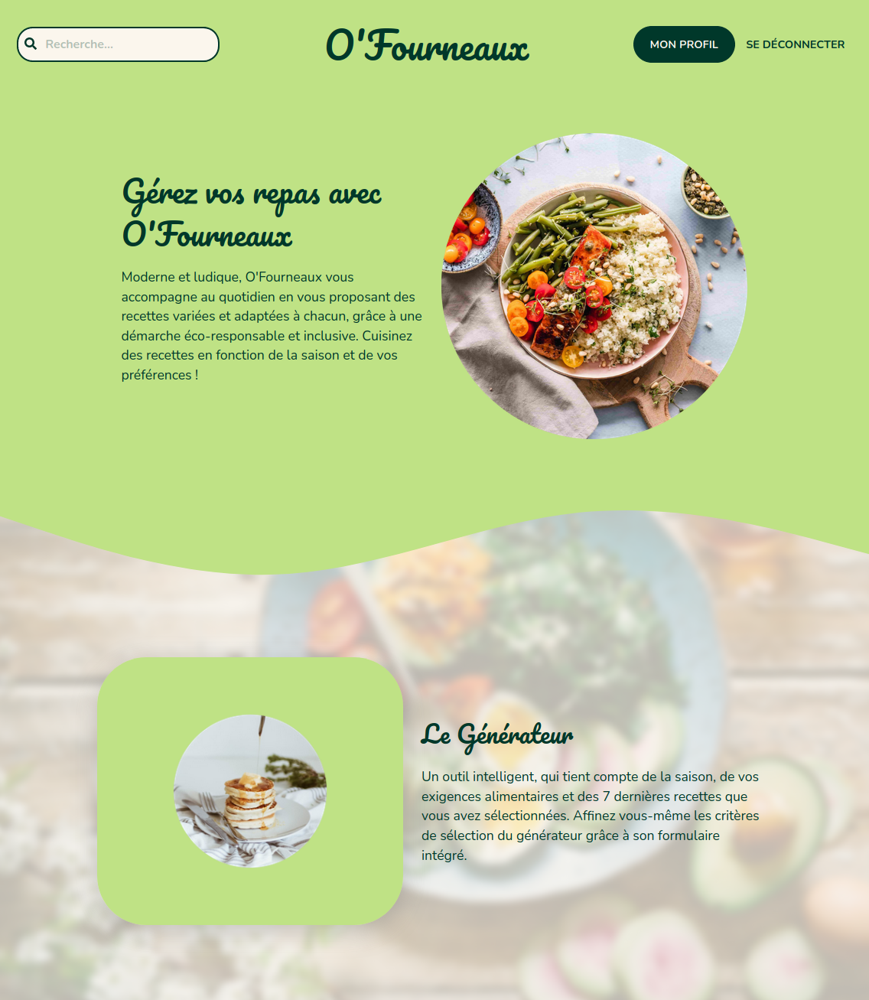
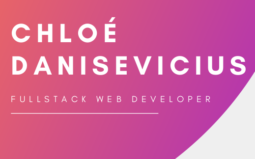

# After one year

## O'Clock bootcamp 🚀

As I wrote in my previous article, I started O'Clock bootcamp, in the Fullstack JS program of 6 months. As expected, it was an intensive program. Great teachers, a real team spirit and efficient training materials made me gain so much hard and soft skills. I met wonderful people who became great colleagues and friends. I worked on many interesting projects that you can find here on my [GitHub](https://github.com/SpookyUmi). 

I know that many people think that bootcamps are not as efficient as a college program of several years of studying. I genuinely think that's not true. No matter the way you choose, learning on your own, following a college program or following a bootcamp. What makes the difference is your determination, your enthusiasm and of course the skills you gained in your learning process. In my bootcamp, I met a lot of different people with different backgrounds. And for the most of us, we are motivated and I'm convinced we will succeed. Web development requires dedication, training a bit everyday, stay up to date and ready to search for the information. In the end, no matter where you come from, if you maintain your hard and soft skills and if you're motivated, you can make it ! That's what I learnt during this one year long journey, and that's what I believe in. 

Beyond all of that, doing this bootcamp and choosing this career shift really changed my life. I believe in myself, and I feel like I'm finally able to do something professionally. I'm proud of what I accomplished in one year. I had the courage to quit my school to follow the web development path which I liked better. And I'm so grateful for that change ! I'm blossoming. Thanks to all the people who helped me and for the support I had. I'm an emotional being so I had to write this paragraph. 😊

## "Apothéose" or O'Fourneaux project

In december 2020, we had to suggest our ideas for the final project with O'Clock, one month of development in a professional environment within a team of 4 to 5 developers. My idea was to create an ambitious recipe platform where everyone could find a fit to their eating requirements. On top of that, I wanted to create a recipe generator which would provide seasonal recipes that corresponds to the user requirements. It also had to provide various recipes instead of suggesting always the same ones. 
We were 5 developers, 3 Front-end and 2 Back-end, to realize this project and we organized our month on an Agile and Scrum conception : each week was a sprint and we had a meeting everyday. Communication was our strength. This month was challenging and we had to reconsider our aims to fit in the allocated time. But we came to a great result and we're satisfied with what we achieved in only one month. [O'Fourneaux](https://ofourneaux.xyz/) will certainly evolve in the future ! 
This final project was a rich experience. I used all the skills I worked on during 6 months, but in a real context, within a team, with goals to fulfill and in a challenging time limit. I really, really loved this month. It was like an achievement of everything we had to do and learn through our 6 month program. It confirmed me that I'm a tech enthusiast. I love working with React and Redux (I love JavaScript anyway haha), but I also had a great time searching for tools to integrate to our project such as Formspree, Fontawesome, Algolia... I even liked the tricky part where I had to host our project and change some configuration parameters. 

## The best is yet to come...

Currently, after this year of learning, I'm looking for my first job ! I look forward to join a nice and motivated team, to contribute to beautiful projects. I'm highly motivated and while searching for a job, I continue to exercise my skills. I'm rebuilding my website entirely in Gatsby ! And I'm also pursuing Kent C. Dodds' React course to improve myself. Later I'd like to learn React Native, GraphQL, Greensock... 
For me, being a developer means to remain curious and to multiply the sources of information. We have the chance to be part of a huge and international community, with a lot of different people who share their skills and achievements. As a french developer, I think this is important to follow anglophone's sources and to not stick to our mother tongue sources only.

See you soon !
